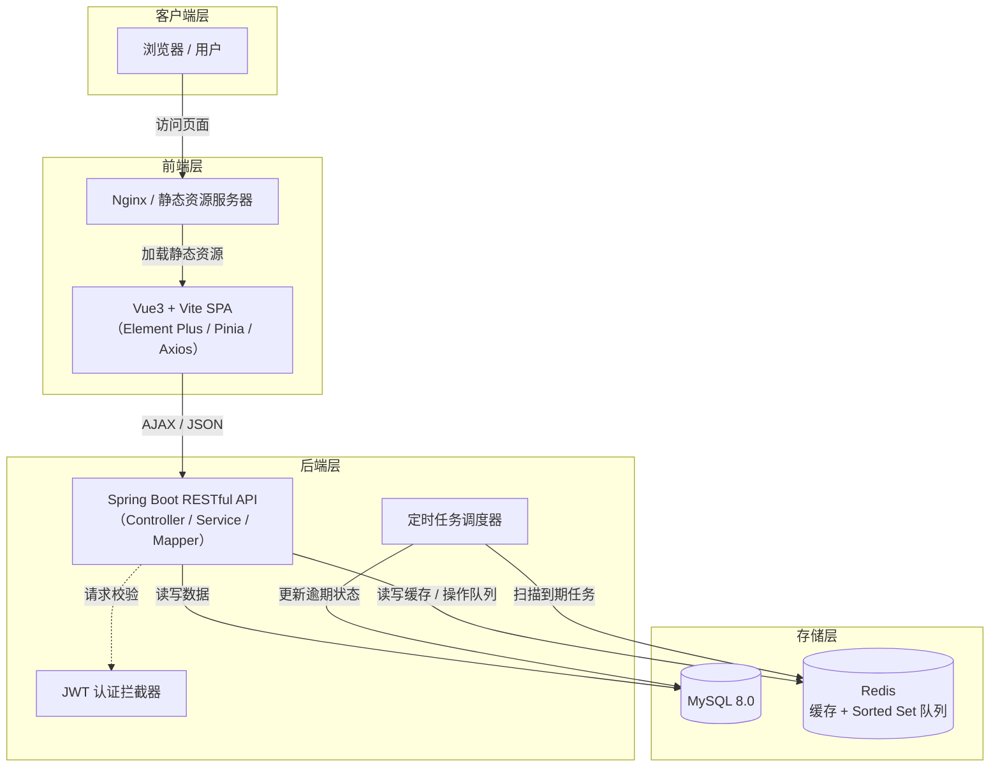
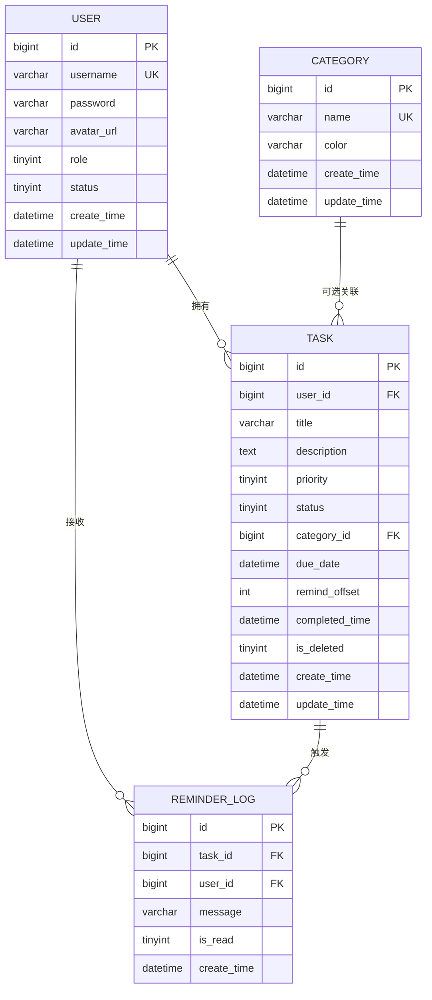

````markdown
# 待办任务管理系统 - 完整设计方案

**项目名称**：待办任务管理系统  
**课程**：企业级应用开发课程设计（重庆科技大学，计科（3+2）2023）  
**设计阶段**：概要设计与详细设计  
**日期**：2026年6月24日

---

## 1. 项目概述

### 1.1 项目背景

在学习和生活中，学生常需管理各类待办事项（作业、考试、社团活动等），传统纸质清单或通用备忘录存在易遗漏、分类混乱、无优先级、统计困难等问题。本项目开发一套轻量级 Web 应用，提供任务创建、分类标签、到期提醒、统计看板等功能，帮助用户高效管理个人事务。

### 1.2 系统目标

- 提供个人任务的全生命周期管理（创建、编辑、状态流转、逻辑删除/恢复）。
- 实现基于 Redis 的到期提醒队列与逾期自动标记。
- 支持管理员维护全局分类标签库，普通用户创建任务时选用。
- 提供个人效率统计（完成率、平均时长、按时率）及管理员平台聚合统计。
- 采用前后端分离架构，基于 Spring Boot + Vue3 + MySQL + Redis 实现。

### 1.3 系统边界

- **包含**：用户注册/登录、JWT认证、任务CRUD与状态流转、全局分类管理（管理员）、站内提醒、逾期标记、个人统计、管理员用户管理及平台统计、头像上传。
- **不包含**：多用户协作、移动端原生App、第三方日历同步、邮件/短信提醒、语音或AI功能。

---

## 2. 系统架构设计

### 2.1 整体架构

采用 **前后端分离的 B/S 架构**，后端提供 RESTful API，前端为单页应用（SPA）。  
**修正后的分层架构图**如下：


````

**架构说明**：

- **客户端层**：用户通过现代浏览器访问系统。
- **前端层**：Nginx 托管 Vue3 构建的静态资源，SPA 通过 Axios 发送 HTTP 请求到后端。
- **后端层**：Spring Boot 提供 RESTful API，集成 JWT 拦截器进行身份认证，定时任务器负责提醒与逾期扫描。
- **存储层**：MySQL 存储业务数据，Redis 用于 Token 缓存和基于 Sorted Set 的延迟提醒队列。

### 2.2 技术栈

| 层次       | 技术                            | 版本/说明       |
| ---------- | ------------------------------- | --------------- |
| 后端框架   | Spring Boot                     | 2.7+ / 3.x      |
| ORM        | MyBatis-Plus                    | 3.5+            |
| 数据库     | MySQL                           | 8.0+ (InnoDB)   |
| 缓存/队列  | Redis                           | 6.0+            |
| 认证       | JWT (jjwt)                      | 0.11.5          |
| 密码加密   | BCrypt (Spring Security Crypto) | -               |
| 前端框架   | Vue3                            | Composition API |
| 构建工具   | Vite                            | 4+              |
| UI组件库   | Element Plus                    | 2.3+            |
| 状态管理   | Pinia                           | 2.0+            |
| HTTP客户端 | Axios                           | 1.4+            |
| 图表库     | ECharts                         | 5.4+            |
| JDK        | OpenJDK                         | 17+             |
| 构建       | Maven (后端) / npm (前端)       | -               |

### 2.3 部署环境

- 后端：Spring Boot 内嵌 Tomcat，打包为 JAR 独立运行。
- 前端：Vite 构建为静态文件，部署至 Nginx 或 Web 服务器。
- 数据库：MySQL 8.0，Redis 6.0 独立服务。
- 浏览器：Chrome 90+ / Edge 90+ / Firefox 90+。

---

## 3. 核心模块设计

根据需求，系统划分为以下五个核心模块：

### 3.1 用户认证与权限管理模块

**功能**：注册、登录、JWT签发与校验、Token Redis缓存、密码加密、个人信息修改、头像上传、基于RBAC的权限控制。

**关键设计**：

- 密码使用 `BCryptPasswordEncoder` 加密存储，强度10。
- JWT 载荷包含 `userId`、`role`、过期时间（24小时）。
- 登录成功后，Token 存入 Redis `token:{userId}`，TTL = 24h + 5min，支持主动下线（删除Redis Key）。
- 使用自定义拦截器（或 Spring Security）进行认证：
  - 公开路径：`/api/auth/register`、`/api/auth/login`、`/api/auth/check-username`。
  - 其余请求需携带 `Authorization: Bearer {token}`，拦截器解析并校验 Redis 中存在。
  - 校验通过后，将 `userId`、`role` 存入 `ThreadLocal`（或 `SecurityContext`），供后续业务使用。
- 权限控制：管理员接口（`/api/admin/**`、`/api/categories` 的写操作）仅允许 `role=1` 访问。

### 3.2 任务全生命周期管理模块

**功能**：任务的创建、列表查询（分页+状态筛选）、详情、编辑、逻辑删除、恢复、状态流转（开始/完成/重新打开/直接完成）。

**状态机设计**（严格遵循需求 3.2.0）：

- 状态枚举：0-待办，1-进行中，2-已完成，3-已逾期。
- 允许的流转：
  - 待办(0) → 进行中(1) （`/start`）
  - 待办(0) → 已完成(2) （`/complete-direct`）
  - 进行中(1) → 已完成(2) （`/complete`）
  - 已完成(2) → 待办(0) （`/reopen`）
  - 待办(0) / 进行中(1) → 已逾期(3) （系统定时任务自动触发）
  - 已逾期(3) → 待办(0) （用户编辑任务延后截止日期时自动回退）

**业务约束**：

- 标题必填，≤200字；优先级默认“中”（值1）；分类可选（`category_id` 可为 NULL）。
- 编辑时：已完成任务不可修改；已逾期任务修改截止日期时，状态回退为待办。
- 逻辑删除：标记 `is_deleted=1`，并从 Redis 提醒队列移除；恢复时重置 `is_deleted=0`，状态置为待办，若截止日期未过期则重新加入提醒队列。
- 数据隔离：所有任务查询/操作必须限定 `user_id = currentUserId`（通过 Service 层强制过滤）。

### 3.3 全局分类标签管理模块（管理员）

**功能**：管理员创建、编辑、删除全局分类标签；所有登录用户可查看分类列表（含使用统计）。

**业务规则**：

- 分类名称全局唯一（唯一索引），颜色默认为 `#9E9E9E`。
- 删除分类时，必须校验 `task` 表中是否存在 `category_id = {id} AND is_deleted = 0` 的记录。
  - 若存在，返回 409 错误，提示关联任务数量，拒绝删除。
  - 若不存在，物理删除该分类。
- 普通用户创建任务时，只能从已有分类中选择，不可创建新分类。

### 3.4 智能提醒与逾期标记模块

**功能**：基于 Redis Sorted Set 实现到期提醒队列，定时生成站内消息；定时扫描逾期任务并自动标记。

**提醒队列设计**：

- Redis Key：`task:reminder:zset`（Sorted Set）。
- Score = `(due_date 时间戳) - (remind_offset * 60 * 1000)`，其中 `remind_offset` 为用户设定的提前分钟数（默认1440，即1天；0表示不提醒）。
- Member = `taskId` 字符串。
- 任务创建或截止日期变更时，更新 ZSet（先 `zrem` 再 `zadd`）。
- 定时任务（每30分钟）执行：
  - 获取当前时间戳，从 ZSet 中取出 score ≤ 当前时间戳的所有 member。
  - 对每个 taskId，查询任务详情（需关联用户），生成提醒消息（如“任务【标题】即将在 X 小时后到期”）。
  - 插入 `reminder_log` 表（含 `task_id`、`user_id`、`message`、`is_read=0`）。
  - 在 Redis 中设置 `reminder:sent:{taskId}` 标记（TTL 7天），避免重复提醒（已提醒过的任务不再处理）。

**逾期标记**：

- 定时任务（每小时）扫描 `task` 表：
  - 条件：`due_date < NOW() AND status IN (0,1) AND is_deleted = 0`。
  - 批量更新 `status = 3`（已逾期）。
- 逾期任务在前端显示时应用红色高亮样式。

### 3.5 数据统计分析模块

**功能**：个人任务概览（各状态数量、完成率）、效率分析（平均完成时长、按时完成率、逾期率）、完成趋势（周/月）；管理员平台聚合统计。

**计算逻辑**：

- **任务概览**：统计当前用户所有非删除任务（`is_deleted=0`）按状态分组数量，完成率 = 已完成数 / 总数 × 100%。
- **效率分析**：
  - 平均完成时长 = Σ(完成时间 - 创建时间) / 已完成任务数（单位：小时）。
  - 按时完成率 = (截止日期前完成的任务数) / 有截止日期的已完成任务数 × 100%。
  - 逾期率 = 逾期任务数 / 总任务数 × 100%。
- **趋势数据**：按周或月统计已完成任务数量，返回时间序列数据供 ECharts 渲染。
- **管理员统计**：查询平台所有用户总数、任务总数、各状态分布、整体完成率、本周新增用户/任务数等。
- **缓存策略**：个人统计结果缓存于 Redis Hash `user:{userId}:stats`，任务变更时主动清除。

---

## 4. 数据库设计

### 4.1 ER 图（核心实体关系）



### 4.2 表结构详细设计

#### 4.2.1 用户表（`user`）

| 字段        | 类型         | 约束                                                           | 说明                    |
| ----------- | ------------ | -------------------------------------------------------------- | ----------------------- |
| id          | BIGINT       | PRIMARY KEY AUTO_INCREMENT                                     | 用户ID                  |
| username    | VARCHAR(50)  | UNIQUE NOT NULL                                                | 用户名                  |
| password    | VARCHAR(255) | NOT NULL                                                       | BCrypt加密密码          |
| avatar_url  | VARCHAR(255) | NULL                                                           | 头像存储路径（相对URL） |
| role        | TINYINT      | NOT NULL DEFAULT 0                                             | 0-普通用户，1-管理员    |
| status      | TINYINT      | NOT NULL DEFAULT 1                                             | 0-禁用，1-正常          |
| create_time | DATETIME     | NOT NULL DEFAULT CURRENT_TIMESTAMP                             | 创建时间                |
| update_time | DATETIME     | NOT NULL DEFAULT CURRENT_TIMESTAMP ON UPDATE CURRENT_TIMESTAMP | 更新时间                |

#### 4.2.2 任务表（`task`）

| 字段           | 类型         | 约束                                                           | 说明                                 |
| -------------- | ------------ | -------------------------------------------------------------- | ------------------------------------ |
| id             | BIGINT       | PRIMARY KEY AUTO_INCREMENT                                     | 任务ID                               |
| user_id        | BIGINT       | NOT NULL, INDEX                                                | 所属用户ID                           |
| title          | VARCHAR(200) | NOT NULL                                                       | 任务标题                             |
| description    | TEXT         | NULL                                                           | 详细描述                             |
| priority       | TINYINT      | NOT NULL DEFAULT 1                                             | 0-低，1-中，2-高                     |
| status         | TINYINT      | NOT NULL DEFAULT 0                                             | 0-待办，1-进行中，2-已完成，3-已逾期 |
| category_id    | BIGINT       | NULL, INDEX                                                    | 所属分类ID（NULL表示“未分类”）       |
| due_date       | DATETIME     | NULL                                                           | 截止日期                             |
| remind_offset  | INT          | NOT NULL DEFAULT 1440                                          | 提醒偏移（分钟），0=不提醒           |
| completed_time | DATETIME     | NULL                                                           | 完成时间                             |
| is_deleted     | TINYINT      | NOT NULL DEFAULT 0                                             | 0-正常，1-逻辑删除                   |
| create_time    | DATETIME     | NOT NULL DEFAULT CURRENT_TIMESTAMP                             | 创建时间                             |
| update_time    | DATETIME     | NOT NULL DEFAULT CURRENT_TIMESTAMP ON UPDATE CURRENT_TIMESTAMP | 更新时间                             |

> 注：不设物理外键，由业务逻辑保证数据一致性。

#### 4.2.3 分类表（`category`）

| 字段        | 类型        | 约束                                                           | 说明                 |
| ----------- | ----------- | -------------------------------------------------------------- | -------------------- |
| id          | BIGINT      | PRIMARY KEY AUTO_INCREMENT                                     | 分类ID               |
| name        | VARCHAR(50) | UNIQUE NOT NULL                                                | 分类名称（全局唯一） |
| color       | VARCHAR(20) | NOT NULL DEFAULT '#9E9E9E'                                     | 颜色值（十六进制）   |
| create_time | DATETIME    | NOT NULL DEFAULT CURRENT_TIMESTAMP                             | 创建时间             |
| update_time | DATETIME    | NOT NULL DEFAULT CURRENT_TIMESTAMP ON UPDATE CURRENT_TIMESTAMP | 更新时间             |

#### 4.2.4 提醒记录表（`reminder_log`）

| 字段        | 类型         | 约束                               | 说明           |
| ----------- | ------------ | ---------------------------------- | -------------- |
| id          | BIGINT       | PRIMARY KEY AUTO_INCREMENT         | 记录ID         |
| task_id     | BIGINT       | NOT NULL, INDEX                    | 关联任务ID     |
| user_id     | BIGINT       | NOT NULL, INDEX                    | 接收用户ID     |
| message     | VARCHAR(500) | NOT NULL                           | 提醒消息内容   |
| is_read     | TINYINT      | NOT NULL DEFAULT 0                 | 0-未读，1-已读 |
| create_time | DATETIME     | NOT NULL DEFAULT CURRENT_TIMESTAMP | 提醒生成时间   |

### 4.3 索引优化策略

```sql
-- 核心查询索引
CREATE INDEX idx_user_status ON task (user_id, status, is_deleted);   -- 任务列表筛选
CREATE INDEX idx_user_deleted ON task (user_id, is_deleted);          -- 统计查询
CREATE INDEX idx_due_date ON task (due_date);                         -- 逾期扫描
CREATE INDEX idx_category_id ON task (category_id);                   -- 分类删除校验
CREATE UNIQUE INDEX idx_username ON user (username);                  -- 用户名唯一
```

### 4.4 Redis 数据结构设计

| Key 模式                 | 类型       | TTL        | 说明                                 |
| ------------------------ | ---------- | ---------- | ------------------------------------ |
| `task:reminder:zset`     | Sorted Set | 永久       | Score = 提醒时间戳，Member = taskId  |
| `token:{userId}`         | String     | 24h + 5min | 存储 JWT，支持主动下线               |
| `reminder:sent:{taskId}` | String     | 7天        | 已提醒标记，防重复                   |
| `user:{userId}:stats`    | Hash       | 永久       | 缓存统计结果（各状态数量、完成率等） |

**提醒队列更新规则**：

- 创建任务：若 `remind_offset > 0` 且 `due_date` 不为空，计算 score，执行 `zadd`。
- 编辑任务：若截止日期或提醒偏移变更，先 `zrem` 旧 member，再 `zadd` 新 score。
- 删除/完成/逾期任务：执行 `zrem` 移除。

---

## 5. 接口设计

### 5.1 统一规范

- **响应格式**：

```json
{
  "code": 200,
  "message": "操作成功",
  "data": { ... }
}
```

- **分页参数**：`page` 从1开始，`size` 默认10，最大50。
- **认证**：请求头 `Authorization: Bearer {token}`。
- **错误码**：
  - 200：成功
  - 400：参数错误 / 业务校验失败
  - 401：未认证 / Token失效
  - 403：无权限
  - 404：资源不存在
  - 409：业务冲突（如分类删除失败）
  - 500：服务器错误

### 5.2 核心 API 列表

#### 5.2.1 认证模块（`/api/auth`）

| 方法 | 路径                        | 功能                                   | 权限     |
| ---- | --------------------------- | -------------------------------------- | -------- |
| POST | `/register`                 | 注册（用户名唯一性校验，BCrypt加密）   | 公开     |
| GET  | `/check-username?username=` | 检查用户名是否可用                     | 公开     |
| POST | `/login`                    | 登录（返回Token及用户信息，存入Redis） | 公开     |
| GET  | `/info`                     | 获取当前用户信息                       | 登录用户 |
| PUT  | `/info`                     | 修改个人信息（用户名）                 | 登录用户 |
| PUT  | `/password`                 | 修改密码（需旧密码验证）               | 登录用户 |
| POST | `/avatar`                   | 上传头像（multipart/form-data，≤2MB）  | 登录用户 |

#### 5.2.2 任务模块（`/api/tasks`）

| 方法   | 路径                    | 功能                       | 权限     | 状态流转            |
| ------ | ----------------------- | -------------------------- | -------- | ------------------- |
| POST   | `/`                     | 创建任务（分类可选）       | 普通用户 | -                   |
| GET    | `/`                     | 任务列表（分页+状态筛选）  | 普通用户 | -                   |
| GET    | `/{id}`                 | 任务详情                   | 普通用户 | -                   |
| PUT    | `/{id}`                 | 编辑任务（含延期回退逻辑） | 普通用户 | 逾期→待办（若延期） |
| DELETE | `/{id}`                 | 逻辑删除                   | 普通用户 | -                   |
| PUT    | `/{id}/restore`         | 恢复任务                   | 普通用户 | -                   |
| PUT    | `/{id}/start`           | 开始任务                   | 普通用户 | 待办→进行中         |
| PUT    | `/{id}/complete`        | 标记完成                   | 普通用户 | 进行中→已完成       |
| PUT    | `/{id}/reopen`          | 重新打开                   | 普通用户 | 已完成→待办         |
| PUT    | `/{id}/complete-direct` | 直接完成                   | 普通用户 | 待办→已完成         |

> 所有状态变更接口均校验前置状态，不符合规则返回400。

#### 5.2.3 分类模块（`/api/categories`）

| 方法   | 路径    | 功能                                  | 权限     |
| ------ | ------- | ------------------------------------- | -------- |
| POST   | `/`     | 创建分类                              | 管理员   |
| GET    | `/`     | 获取所有分类（含使用统计）            | 登录用户 |
| PUT    | `/{id}` | 编辑分类                              | 管理员   |
| DELETE | `/{id}` | 删除分类（校验关联任务，冲突返回409） | 管理员   |

#### 5.2.4 提醒模块（`/api/reminders`）

| 方法 | 路径            | 功能                 | 权限     |
| ---- | --------------- | -------------------- | -------- |
| GET  | `/`             | 提醒消息列表（分页） | 登录用户 |
| GET  | `/unread-count` | 未读提醒数量         | 登录用户 |
| PUT  | `/{id}/read`    | 标记单条已读         | 登录用户 |
| PUT  | `/read-all`     | 全部标记已读         | 登录用户 |

#### 5.2.5 统计模块（`/api/stats`）

| 方法 | 路径                        | 功能                                     | 权限     |
| ---- | --------------------------- | ---------------------------------------- | -------- |
| GET  | `/overview`                 | 个人任务概览（各状态数量、完成率）       | 普通用户 |
| GET  | `/efficiency`               | 个人效率分析（平均时长、按时率、逾期率） | 普通用户 |
| GET  | `/trends?period=week/month` | 完成趋势数据                             | 普通用户 |

#### 5.2.6 管理员模块（`/api/admin`）

| 方法 | 路径                         | 功能                   | 权限   |
| ---- | ---------------------------- | ---------------------- | ------ |
| GET  | `/users`                     | 用户列表（分页）       | 管理员 |
| PUT  | `/users/{id}/status`         | 启用/禁用账号          | 管理员 |
| PUT  | `/users/{id}/reset-password` | 重置密码（返回新密码） | 管理员 |
| GET  | `/stats/overview`            | 平台聚合统计           | 管理员 |

---

## 6. 安全设计

### 6.1 认证与授权

- **密码加密**：BCrypt 强度10，不可逆。
- **JWT 管理**：有效期24小时，载荷含 `userId`、`role`。
- **Token 缓存**：存储于 Redis，支持主动下线（删除 `token:{userId}`）。
- **拦截器**：除公开接口外，所有请求需校验 Token 有效性及 Redis 存在性。
- **RBAC**：管理员接口通过角色校验控制。

### 6.2 数据隔离（一票否决项）

- 所有任务相关查询必须在 Service 层追加 `user_id = currentUserId`。
- 使用 `ThreadLocal` 存储当前用户信息，确保过滤强制生效。
- 分类删除前必须查询关联任务（`is_deleted=0`），存在则拒绝。

### 6.3 输入校验与防注入

- 后端使用 JSR-303 注解（`@NotBlank`、`@Size`、`@Min` 等）校验入参。
- MyBatis 参数化查询（`#{}`），杜绝 SQL 注入。
- 前端对用户输入进行转义（Element Plus 自动处理 XSS）。

### 6.4 跨域与传输安全

- CORS 配置仅允许前端域名（开发环境可放宽）。
- 生产环境建议启用 HTTPS（课程设计可忽略）。

---

## 7. 定时任务设计

### 7.1 到期提醒任务

- **调度**：`@Scheduled(cron = "0 */30 * * * ?")`（每30分钟）。
- **执行逻辑**：
  1. 获取当前时间戳 `now`。
  2. 从 Redis ZSet `task:reminder:zset` 中取出 score ≤ now 的 member（`ZRANGEBYSCORE ... 0 now`）。
  3. 遍历 member，对每个 taskId：
     - 检查 Redis 中是否存在 `reminder:sent:{taskId}`，若存在则跳过。
     - 查询任务详情（含 user_id、title、due_date）。
     - 生成提醒消息，插入 `reminder_log`。
     - 设置 `reminder:sent:{taskId}` 标记（TTL 7天）。
  4. 可选：从 ZSet 中移除已处理的 member（或保留但由标记控制）。

### 7.2 逾期标记任务

- **调度**：`@Scheduled(cron = "0 0 * * * ?")`（每小时）。
- **执行逻辑**：
  1. 执行 SQL：`UPDATE task SET status = 3 WHERE due_date < NOW() AND status IN (0,1) AND is_deleted = 0`。
  2. 同时从 Redis ZSet 中移除这些任务（可选，但已完成/逾期任务不应再提醒）。

---

## 8. 性能与缓存策略

### 8.1 数据库性能

- 按 4.3 节建立索引，确保高频查询走索引。
- 分页查询使用 `LIMIT offset, size`，配合索引排序。
- 统计类查询使用缓存减少 DB 压力。

### 8.2 Redis 缓存

- **用户统计缓存**：Key `user:{userId}:stats`，Hash 存储各状态数量、完成率等。
  - 缓存失效时机：任务创建、状态变更、删除、恢复时主动删除该 Hash。
  - 查询统计时优先读缓存，缓存不存在则查库并回填。
- **提醒队列**：使用 Sorted Set 实现延迟队列，避免数据库轮询。

### 8.3 前端性能

- 路由懒加载，减少首屏加载时间。
- 表格虚拟滚动（任务数 > 500 时启用）。
- ECharts 按需加载图表组件。

---

## 9. 非功能需求保障

| 需求         | 指标                    | 实现措施                           |
| ------------ | ----------------------- | ---------------------------------- |
| 页面加载时间 | ≤ 3秒                   | 前端按需加载、CDN、资源压缩        |
| API响应时间  | 普通 < 500ms，统计 < 2s | 索引优化、统计缓存、分页限制       |
| 并发支持     | ≥ 50用户                | 连接池、Redis缓存、数据库连接优化  |
| 提醒延迟     | ≤ 30分钟                | 定时任务周期30分钟，可调优         |
| 安全性       | 防注入、防越权          | 参数化查询、数据隔离强制校验       |
| 可用性       | 界面友好、操作反馈清晰  | Element Plus组件、全局异常统一提示 |

---

## 10. 开发与测试里程碑

| 阶段         | 时间    | 任务重点                                     | 交付物                 |
| ------------ | ------- | -------------------------------------------- | ---------------------- |
| 环境搭建     | 第1-2天 | 数据库初始化、Redis配置、项目骨架、JWT工具类 | 可启动项目、DDL脚本    |
| 核心功能开发 | 第3-5天 | 任务CRUD、状态机、分类管理、提醒队列基础     | 接口通过Postman测试    |
| 提醒与统计   | 第6-7天 | 定时任务、统计缓存、图表数据接口             | 完整后端API            |
| 前端联调     | 第8-9天 | Vue3页面、Axios对接、ECharts渲染、联调测试   | 可运行系统             |
| 文档与演示   | 第10天  | 测试报告、设计文档、演示PPT                  | 课程设计报告、系统演示 |

---

## 11. 附录

### 11.1 关键业务规则速查

- **分类非必选**：`category_id` 可为 NULL，表示“未分类”。
- **状态流转**：严格遵循 3.2.0 规则，非法状态变更返回400。
- **逻辑删除**：仅标记 `is_deleted=1`，数据保留。
- **分类删除**：必须无有效任务关联，否则返回409。
- **提醒偏移**：默认提前1天（1440分钟），0表示不提醒。
- **密码重置**：管理员重置密码不验证旧密码，直接生成新密码返回。

### 11.2 配置示例

```properties
# application.yml
spring:
  datasource:
    url: jdbc:mysql://localhost:3306/todo_db?useSSL=false&serverTimezone=Asia/Shanghai
    username: root
    password: 123456
  redis:
    host: localhost
    port: 6379
jwt:
  secret: your-256-bit-secret-key
  expiration: 86400000  # 24h
```

```javascript
// vite.config.js
export default {
  server: {
    proxy: {
      "/api": "http://localhost:8080",
    },
  },
};
```

### 11.3 测试用例关键场景

| 场景                      | 预期结果                     |
| ------------------------- | ---------------------------- |
| 用户A访问用户B任务        | 返回404或403                 |
| 删除含关联任务的分类      | 返回409，含任务数量          |
| 对已完成任务调用 `/start` | 返回400，提示状态不允许      |
| 截止日期过时              | 定时任务自动标记逾期         |
| 登录后Token缓存           | 主动下线时删除Token使JWT失效 |

---

_文档版本：v1.0_  
_编写日期：2026年6月24日_

```

```
